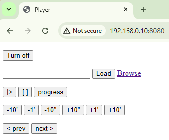

mpvkiosk
========

This little project is written to allow easy control of mpv running on a
little raspberry pi which has a monitor connected to it, but no keyboard.

The project is build with two components. [*jakserver*](./jakserver.c) is the tiniest HTTP
server, which fully delegates request handling to a subprocess running
a single possible script. See [*jakserver(1)*](./jakserver.1) for more
information on it. It's great for prototyping and not worrying about configuring
a full apache or httpd.

The other component is the [*handler.sh*](./handler.sh) which implements the
"remote control" web page. This makes sure to run a daemonized *mpv(1)* and
talks to it by way of its inbuilt `--input-ipc-server`.

In my case, *mpv(1)* is running in a *sway(1)* session.

The web interface ([*handler.sh*](./handler.sh)) is a barebones remote control.

You can paste a local path or a weblink (supported by *mpv(1)* by way of *yt-dlp(1)*) and hit `Load` to play. Alternatively, you can browse the local file system; video and audio files will have a button to start playing. Other than that, play/pause, stop, seek etc are pretty self explanatory.

The `Turn Off` button is a panic button which shuts down the remote mpv in case anything went haywire. Or, just if you want to shut down that process. The stop button merely instructs mpv to stop playing, the process continues to hang around in the background.

Installation
------------

Install *jakserver*

    make
    make install

Put the *handler.sh* script somewhere intelligent (e.g. /var/www/handler.sh),
then run *jakserver*

    install -m 755 -D handler.sh /var/www/handler.sh
    env DISPLAY=:0 jakserver -x /var/www/handler.sh -p 8080

You should set up a `chroot(1)` in `/var/www` and/or run `jakserver` as
a somewhat limitted user. Some sort of socket needs to be poked through the
chroot (mpv ipc socket, X11 socket, Wayland socket etc).

You can customize the `handler.sh` script to do what you want. E.g. add
support for *feh(1)* to look at pictures, or playlist support, etc. There are
[other examples](./example_handlers/README.md) if you want the server to do
something else which is more complicated.

There's an [example systemd unit](./mpvkiosk.service) which you can drop
in `/etc/systemd/system/mpvkiosk.service` and turn it on at boot. In my case,
I have *sway(1)* autostart and autologin, and it has the advantage that any
app is effectively full screen by default. *sway* starts up as `wayland-1` by default, *gnome-shell* may start up as `wayland-0`. For X11 systems, you'd need to set `DISPLAY=:0` or whatever it was started as.
